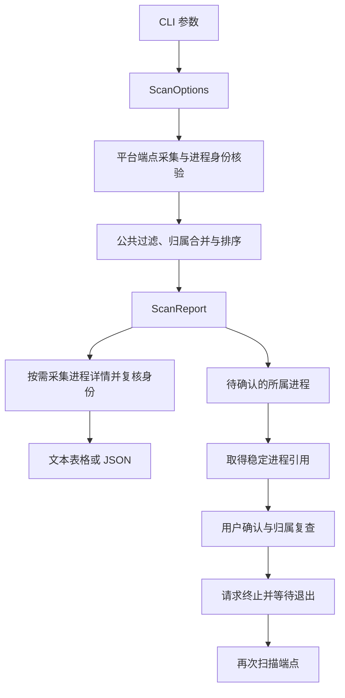

# 架构设计

portsnap 将操作系统中的套接字和进程信息转换为统一报告，再由命令行入口决定展示或终止操作。核心设计目标是让查询语义跨平台一致、数据缺失可见，并在进程身份发生变化时拒绝执行终止。

## 模块职责

| 模块 | 职责 | 设计目的 |
| --- | --- | --- |
| [main](../src/main.rs) | 参数约束、交互确认、调用顺序、退出码 | 将面向用户的操作规则集中在命令行入口 |
| [model](../src/model.rs) | 查询条件、端点、进程身份和报告类型 | 为平台实现、展示和自动化提供共同的数据契约 |
| [scanner](../src/scanner/mod.rs) | 分发平台采集、公共过滤、归属合并和排序 | 保持各平台一致的查询和结果组织方式 |
| [process](../src/process.rs) | 读取原生身份和名称，按需补充进程详情 | 独立核验身份并复用详情，避免刷新全部系统指标 |
| [killer](../src/killer.rs) | 持有稳定系统引用、请求终止、等待退出 | 将进程生命周期和平台终止 API 封装在独立模块中 |
| [output](../src/output.rs) | 表格、地址和诊断的文本展示 | 让平台采集代码只产生数据，不参与终端交互 |

[src/lib.rs](../src/lib.rs) 暴露核心模块。平台实现通过条件编译选择，支持 Linux、Windows 和 macOS；其他目标给出明确的编译错误。

## 数据流

查询、进程身份核验和终止是不同职责：看到一个 PID 并不等于已确认它仍是同一个进程；确认进程退出也不等于相关端点已经全部消失。

## 数据模型

| 类型 | 主要信息 | 作用 |
| --- | --- | --- |
| `ScanOptions` | 本地端口集合、是否只查监听、可选协议和地址族 | 统一初次查询和终止复查的过滤条件 |
| `SocketInfo` | 协议、本地/远程端点、TCP 状态、所属进程、归属完整性 | 保留定位占用所需的上下文 |
| `ProcessInfo` | PID、可选名称、可选身份和可选详情 | 保留已知信息，允许部分数据不可读取 |
| `ProcessIdentity` | PID、原生启动标识 | 区分复用同一个 PID 的不同进程 |
| `ProcessDetails` | 路径、参数、用户、父 PID、Unix 启动时间及字段诊断 | 为定位运行实例提供上下文，明确区分空值与采集失败 |
| `DiagnosticCode` | 稳定的错误分类 | 让脚本按原因处理部分结果，避免依赖错误文本 |
| `ScanReport` | 版本号、端点列表、完整性、诊断 | 区分完整结果、部分结果和扫描失败 |

地址使用 `IpAddr`，端口使用 `u16`。IPv6 的接口名称或索引单独保存在可选 scope 字段中，避免把地址、作用域和端口混成难以处理的字符串。

一个进程可以持有多个端点，一个端点也可以由多个进程共享，因此 `owners` 使用数组。缺少身份时仍可展示已知 PID，但该记录不能用于终止操作。

`ScanReport.complete` 表达在当前查询范围及平台可见性内是否发现影响完整性的问题。它与每条记录的 `ownership` 分开：例如，一张请求的协议表读取失败会使整个报告不完整，其他成功读取的端点仍可以有已核验的所属进程；可选详情字段失败同样不改变已有归属状态。字段定义见 [JSON 接口](json.md)。

## 平台采集

### Linux：协议表与 inode 关联

[Linux 后端](../src/scanner/linux.rs) 根据协议和地址族选择 `/proc/self/net/tcp`、`tcp6`、`udp`、`udp6`，保留地址、TCP 状态和套接字 inode。跳过未请求的表，先按查询条件筛选，再为目标 inode 建立进程归属索引。

归属索引通过一次 `/proc/*/fd` 遍历构建，将 `socket:[inode]` 关联到所有可见持有者。同一个进程持有同一套接字的多个 FD 时只记录一次；不同进程的持有记录全部保留。这让多个端口查询共享一次遍历成本，也支持父子进程或 worker 共享监听套接字的场景。

读取 FD 前后会核验相关进程的启动标识；身份变化的观察不能成为可终止目标。权限拒绝、相关归属变化和 `hidepid` 等可见性限制通过报告表达，普通进程或 FD 消失不逐条刷屏。

`/proc/self/net` 将扫描限定在当前网络命名空间。其他容器或命名空间中的端点需要在相应环境内查询。

### Windows：IP Helper 表

[Windows 后端](../src/scanner/windows.rs) 按查询条件读取 IPv4/IPv6 的 TCP/UDP 系统表，跳过未请求的协议和地址族。TCP 使用包含全部状态的表类型，由公共查询规则决定是否只保留监听记录。原生字段提供地址、端口、状态、归属 PID 和 IPv6 scope。

四类表分别处理错误，避免一个数据源失败就丢弃其他可用结果。系统缓冲区的长度和行边界在读取前检查，字段转换遵循原生结构和网络字节序。

归属信息以 IP Helper 返回的 owning PID 为准，不保证枚举所有跨进程复制的套接字句柄。UDP 表不提供远程端点，因此对应字段为空。

### macOS：lsof 字段协议

[macOS 后端](../src/scanner/macos.rs) 调用系统 `/usr/sbin/lsof`，查询 TCP 和 UDP，并关闭域名、服务名解析。采集使用 `-F0` 的 NUL 分隔字段协议，按进程记录和文件记录组织数据，不依赖表格列宽。

选择器先限制协议；IPv4 查询可使用 `-i4TCP` / `-i4UDP`。IPv6 查询保留同协议的两类地址采集，再按原生地址族过滤，因为 `lsof -i6` 可能排除 IPv4 映射 IPv6 连接。此处不能只依赖 lsof 的地址选择语义。

解析器分别读取协议、地址族、本地/远程端点和状态，并保留 IPv6 scope。IPv6 套接字以 IPv4 文本表示连接地址时，转换为对应的 IPv4 映射 IPv6 地址。无本地端口的未绑定套接字不进入结果。

命令退出状态、stdout 和 stderr 一起决定结果：`lsof` 可能在一个选择条件没有匹配时返回 1，同时为另一个条件输出有效记录。可用数据伴随诊断时标记为部分结果；执行失败或字段结构无效时返回错误。普通用户运行时也会标记可能缺少其他用户套接字的可见性限制。

### Windows/macOS 的归属核验

系统端点记录通常只含数字 PID。公共采集流程先用一轮快照收集相关 PID 并读取身份，再获取将要返回的端点快照，随后核验身份是否保持一致。

第二轮才出现的 PID、无法读取身份的进程或身份发生变化的进程仍可出现在结果中，但其可用身份为空。同类进程元数据问题按数量汇总，并附有数量和长度限制的示例。

## 公共结果整理

公共层再次应用 `ScanOptions`，然后按协议、本地端点、远程端点、scope 和 TCP 状态合并等价记录。结果是端点视图，不保留每个底层 FD 的独立行；所属进程集合经过合并和去重。

端点按本地端口及其余端点属性稳定排序，所属进程按 PID 排序。归属完整性按较保守的状态合并。同一 PID 出现冲突身份时，清除该身份并给出诊断，避免任意选择一个快照用于终止。

## 按需进程详情

CLI 在初次展示和终止后的最终展示前，按 `--details` 调用 `process::enrich_details`。该选项独立于 `ScanOptions`，因此确认后的归属复查不会重复采集路径、命令行和用户等展示字段。

公共详情层按 `(pid, identity)` 缓存一次采集结果，避免共享端点重复读取。没有可核验身份时直接返回身份诊断；有身份时在原生读取前后再次核验，身份变化或核验失败会清空本次详情。详情描述一个经过身份核验的进程观察，不保证所有可变字段来自同一个原子快照。

| 平台 | 详情数据源 |
| --- | --- |
| Linux | `/proc/<pid>/exe`、`cmdline`、`status`、`stat`，以及系统启动时间和 tick 频率；有效 UID 通过可重入账户查询解析 |
| macOS | `proc_pidpath`、BSD 进程信息和 `KERN_PROCARGS2`；按系统缓冲区边界与 argc 读取参数，不把环境区当作参数 |
| Windows | 持有进程句柄读取路径、FILETIME 和令牌 SID；Toolhelp 获取父 PID；有界 `NtQueryInformationProcess(ProcessCommandLineInformation)` 查询命令行并交 `CommandLineToArgvW` 解析 |

Windows 命令行查询验证本地缓冲区的长度、指针范围和 UTF-16，不读取私有 PEB 或远程内存布局；接口不可用时返回字段诊断。原生空命令行单独处理，避免 Windows 参数解析器将其替换为工具自身路径。

每个字段独立产生值或结构化诊断；账户名缺失时仍可保留用户 ID。字段诊断使报告不完整，同时按代码汇总到报告层，避免大量进程问题反复刷屏。身份启动标识始终保留原生精度，展示时间另存为 Unix 毫秒并在文本中转换为 UTC。

## 终止模块

`PreparedTarget` 在用户确认前取得并持有稳定的操作系统引用。Linux 使用 pidfd，Windows 使用进程句柄，macOS 使用 Mach 任务端口。平台实现负责引用释放、终止请求和退出等待，CLI 负责确认、端口归属复查及最终结果展示。

Linux 还会检查 `/proc/self` 和 pidfd 的 fdinfo，确认 `/proc` 中的 PID 与进程句柄对应，防止不同 PID 命名空间的编号混用。没有可核验身份或稳定引用时，终止会被拒绝。

完整执行规则及平台差异见 [功能设计](features.md)。
